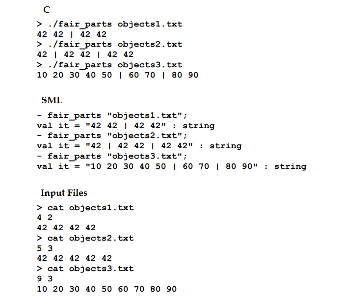

## About
Given a sequense of N numbers and M intervals, find the way to devide the numbers in M intervals, in the most balanced way. Balanced is 
defined by minimizing the maximum sum of all intervals.

## Examples

