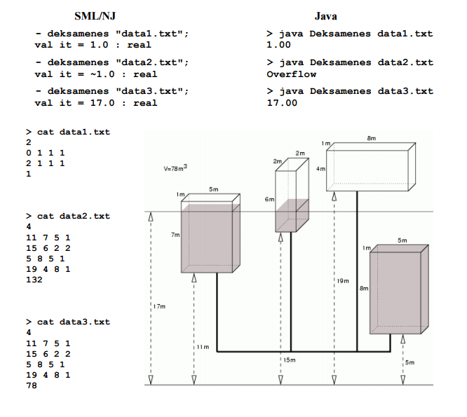

## About
Given N tanks (size and height) and the Volume of water, find the height it will reach. Tanks are connected as in image 
 
 
## Input
N 
Tank1 
Tank2 
... 
TankN 
Total Volume 
 
where 
Tanki=B H W L 
B=height of the base 
H=height of tank 
W=Width of tank 
L=Length of tank 

## Output
height the water will reach
